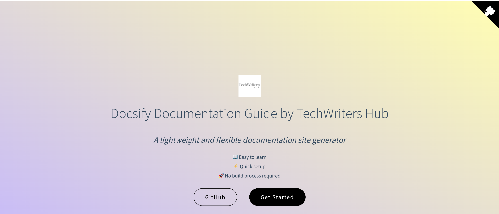

# 📖 Docsify Documentation Template  

[](https://www.npmjs.com/package/docsify)
[](LICENSE)
[](https://docsify-template.netlify.app/#/)

**A ready-to-use Docsify template** for technical documentation, tutorials, or project wikis. Pre-configured with plugins, themes, and deployment guides.  

 

## 🚀 Features  
- ✅ **Pre-configured setup**: Sidebar, navbar, cover page, and search.  
- 📝 Write documentation in Markdown
- 🔌 **Plugins**: Search, code copy and pagination. 
- 📦 **Deployment**: Guides for GitHub Pages and Netlify.  

## 🛠️ Getting Started  

### Prerequisites  
- Node.js & npm  
- Basic familiarity with Markdown  

### Installation  
1. **Clone this repo**:  
   ```bash
   git clone https://github.com/your-username/docsify-template.git
   cd docsify-template
   ```

2. **Install Docsify CLI globally**

    ```bash
    npm install -g docsify-cli
    ```


3. **Run project locally**

    ```
    docsify serve ./docs   
    ```


## License

MIT License. See LICENSE.

---
Forked from TechWriters Hub? Give it a ⭐!