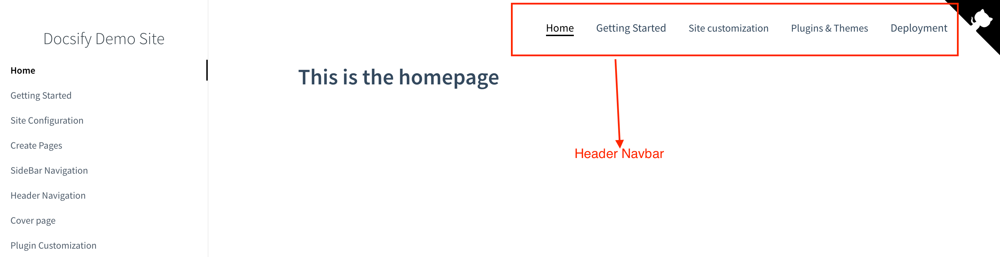

# Adding Navigation Header

This is similar to how you'll add a navigation using sidebar. The difference is that the header is at the top of the page. By default, Docsify does not generate a header.

Enable the navigation bar in your index.html file.

```html
<script>
  window.$docsify = {
    loadNavbar:true,
  };
</script>
```
Next, create a _navbar.md file in your docs folder and add the links to your pages.

```markdown
- [Home](README.md)
- [Getting Started](getting-started.md)
- [Features](features.md)
- [Customization](customization.md)
```

## Creating a Drop-Down Header Menu

To create dropdown menus, nest items under a main header using indentation:

```markdown
- [Home](README.md)

- [Guides]()
  - [Installation](installation.md)
  - [Configuration](configuration.md)
  - [Usage](usage.md)

- [Resources]()
  - [API Reference](api-reference.md)
  - [Best Practices](best-practices.md)
  - [Troubleshooting](troubleshooting.md)
```

Your header should look like te image below:



> Please note that every page you link must have a corresponding markdown file in your docs folder.
