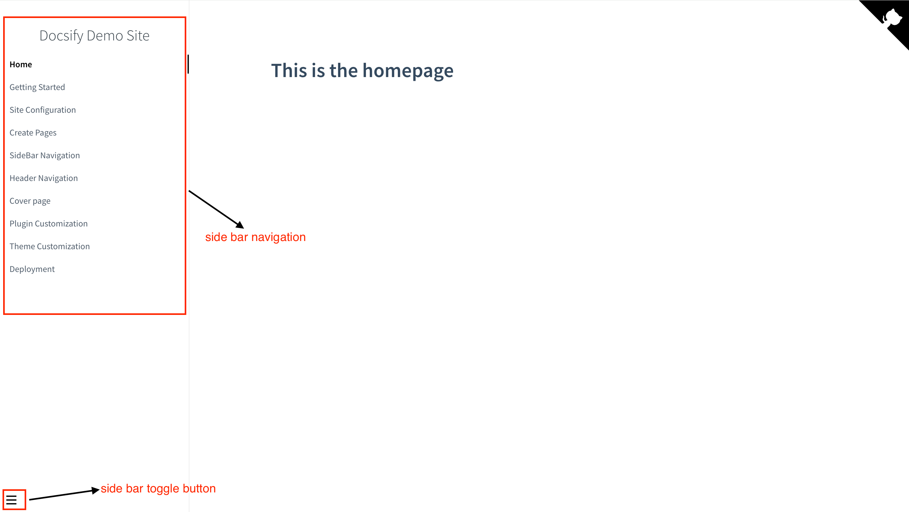

# Adding Navigation with Sidebar
The sidebar provides structured navigation for your documentation.

## Using a Custom Sidebar (_sidebar.md)

To enable the sidebar, add the following to your index.html file:

```html
<script>
  window.$docsify = {
    loadSidebar: true,
    subMaxLevel: 2
  };
</script>
```

Next, create a _sidebar.md file in your docs folder and add the links to your pages.

```markdown
- [Home](README.md)
- [Getting Started](getting-started.md)
- [Features](features.md)
- [Customization](customization.md)
```
> Ensure your markdown files are in the same folder as your _sidebar.md file for it to work.

This is what your sidebar should look like:




## Creating a Nested Sidebar Structure

A nested sidebar helps organize your documentation by grouping related topics under collapsible sections.

In your `/docs` folder, create subfolders, and place the corresponding files inside them. Your file structure should look like this:

```bash
docs/
│── _sidebar.md
│── README.md
│── .nojekyll
│── getting-started/
│   ├── intro.md
│   ├── installation.md
│── configuration
│   ├── plugins.md
│   └── themes.md

```
Next, update `_sidebar.md` by adding links to the folders and pages you've created. Use two-space indentation for nesting:

```markdown
- **Getting Started**
  - [Introduction](getting-started/intro.md)
  - [Installation](getting-started/installation.md)

- **Configuration**
  - [Plugins](configuration/plugins.md)
  - [Themes](configuration/themes.md)
```

> P.S.: Bold section titles (** Title **) create non-clickable headers for grouping related topics.


## Using an Auto-Generated Sidebar (maxLevel)

If you want Docsify to generate a sidebar from a single file, use maxLevel instead. With maxLevel, you do not need to enable the sidebar. This will create a sidebar only from README.md

```html
<script>
  window.$docsify = {
    maxLevel: 3
  };
</script>
```